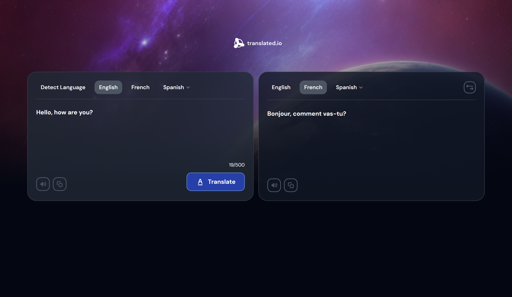

<h1 align="center">Translate App using React, Typescript and Tailwind CSS</h1>

   Solution for a challenge <a href="https://devchallenges.io/challenge/translate-app" target="_blank">Translate app</a> from <a href="http://devchallenges.io" target="_blank">devChallenges.io</a>.

  <h3>
    <a href="{https://your-demo-link.your-domain}">
      Demo
    </a>
     | 
    <a href="https://github.com/leonard-ramos27/Translate-App-React.git">
      Solution
    </a>
     | 
    <a href="https://devchallenges.io/challenge/translate-app">
      Challenge
    </a>
  </h3>

## Table of Contents

- [Table of Contents](#table-of-contents)
- [Overview](#overview)
- [Built with](#built-with)
- [Features](#features)
- [Author](#author)

## Overview

A responsive translation app that connects to a third-party API to translate text between different languages and uses debouncing for real-time update. This application/site was created as a submission to a [DevChallenges](https://devchallenges.io/challenges-dashboard) challenge. 

## Built with

- [React](https://react.dev/)
- [Typescript](https://www.typescriptlang.org/)
- [Tailwind](https://tailwindcss.com/)

## Features

- Users are able to translate text of up to 500 characters.
- Allows users to select from 5 different languages: English, French, spanish, Italian, German.
- Users can switch the translating language and translated language.
- Lets the user listen to the translating text and the translated text.
- Lets the user copy the translating and the translated text.

## Author

- Website [leonard-ramos-dev.netlify.app](https://leonard-ramos-dev.netlify.app/)
- GitHub [@leonard-ramos27](https://github.com/leonard-ramos27)