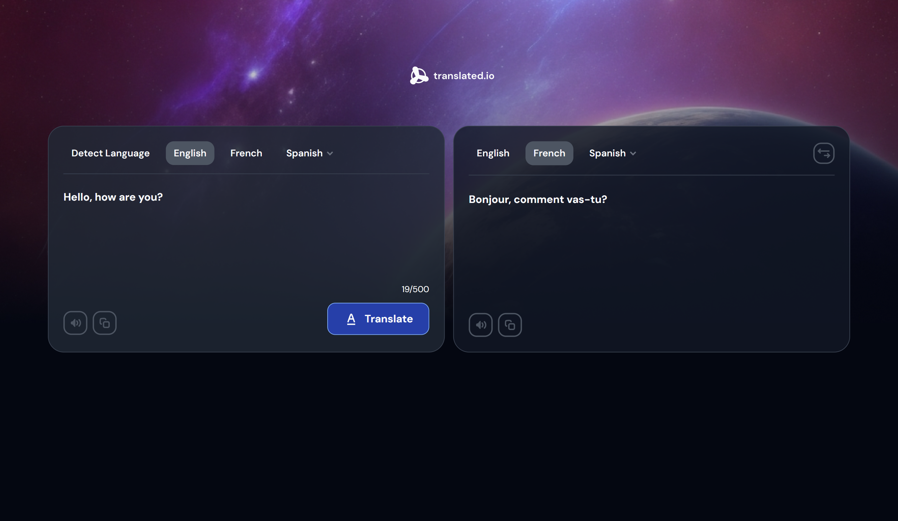

<a id="readme-top"></a>
<br />
<div align="center">
  <a href="https://github.com/github_username/repo_name">
    
  </a>
  <h3 align="center">Translate App</h3>
</div>

<details>
  <summary>Table of Contents</summary>
  <ol>
    <li>
      <a href="#-about-the-project">About The Project</a>
    </li>
    <li>
      <a href="#-live-demo">Live Demo</a>
    </li>
    <li>
      <a href="#-screenshot">Screenshot</a>
    </li>
    <li>
      <a href="#-features">Features</a>
    </li>
    <li>
      <a href="#-tech-stack">Tech Stack</a>
    </li>
    <li>
      <a href="#-getting-started">Getting Started</a>
    </li>
    <li>
      <a href="#-testing">Testing</a>
    </li>
    <li>
      <a href="#-cigithub-actions">CI / Github Actions</a>
    </li>
    <li>
      <a href="#-author">Author</a>
    </li>
  </ol>
</details>

## 🌐 About The Project

A responsive text translation web application built with React, TypeScript and Redux Toolkit Query. This project was developed as part of a challenge from [DevChallenges](https://devchallenges.io/challenge/translate-app) to practice building modern frontend applications with API integration, testing, and CI workflows.

<p align="right">(<a href="#readme-top">back to top</a>)</p>

## 🚀 Live Demo

<a href=">https://translated-io-react.netlify.app/" target="_blank">https://translated-io-react.netlify.app/</a>

<p align="right">(<a href="#readme-top">back to top</a>)</p>

## 📸 Screenshot



<p align="right">(<a href="#readme-top">back to top</a>)</p>

## ✨ Features

* Translate text of up to 500 characters between different languages
* Display translated text in realtime or by clicking the Translate button
* Swap translating language and translated language
* Listen to the translating or the translated text
* Copy the translating or the translated

<p align="right">(<a href="#readme-top">back to top</a>)</p>

## 🛠 Tech Stack

#### Frontend, Type Safety and Styling :
[![React][React.js]][React-url]
[![TypeScript][TypeScript.org]][TypeScript-url]
[![Tailwind CSS][TailwindCSS.com]][Tailwind-url]

#### State Management :
[![Redux Toolkit][Redux.js]][Redux-url]
[![RTK Query][RTKQuery.js]][RTKQuery-url]

#### Testing :
[![Vitest][Vitest.dev]][Vitest-url]
[![React Testing Library][RTL.js]][RTL-url]

#### Build Tool :
[![Vite][Vite.dev]][Vite-url]

#### CI/CD :
[![GitHub Actions][GitHubActions.com]][GitHubActions-url]

#### Deploy :
[![Netlify][Netlify.com]][Netlify-url]

<p align="right">(<a href="#readme-top">back to top</a>)</p>

## 💻 Getting Started

### Prerequisites

Install:
* Node.js
* npm

Check your version:
  ```sh
  node -v
  ```

### Installation

1. Clone the repo
   ```sh
   git clone https://github.com/leonard-ramos27/Translate-App-React.git
   ```
2. Navigate to the project folder
   ```sh
   cd translate-app-react
   ```
3. Install dependencies
   ```sh
   npm install
   ```
4. Run the development server
   ```js
   npm run dev
   ```

<p align="right">(<a href="#readme-top">back to top</a>)</p>


## 🧪 Testing

This project includes automated tests using:
* Vitest
* React Testing Library

To run the tests:
```js
npm run test
```

Tests run automatically using GitHub Actions when:
* A Pull Request is opened
* Code is pushed to the main branch

<p align="right">(<a href="#readme-top">back to top</a>)</p>

## 🔄 CI/GitHub Actions

The project includes a CI workflow that:
* Installs dependencies
* Runs tests
* Prevents merging if tests fail (when branch protection is enabled)

Workflow file location:
```sh
.github/workflows/ci.yml
```

<p align="right">(<a href="#readme-top">back to top</a>)</p>

## 👨‍💻 Author

[Leonard Ramos - Web Developer](https://leonard-ramos-dev.netlify.app/)
<br/>
[GitHub : @leonard-ramos27](https://github.com/leonard-ramos27)

<p align="right">(<a href="#readme-top">back to top</a>)</p>


[React.js]: https://img.shields.io/badge/React-20232A?style=for-the-badge&logo=react&logoColor=61DAFB
[React-url]: https://reactjs.org/
[TypeScript.org]: https://img.shields.io/badge/TypeScript-007ACC?style=for-the-badge&logo=typescript&logoColor=white
[TypeScript-url]: https://www.typescriptlang.org/
[Redux.js]: https://img.shields.io/badge/Redux_Toolkit-593D88?style=for-the-badge&logo=redux&logoColor=white
[Redux-url]: https://redux-toolkit.js.org/
[RTKQuery.js]: https://img.shields.io/badge/RTK_Query-764ABC?style=for-the-badge&logo=redux&logoColor=white
[RTKQuery-url]: https://redux-toolkit.js.org/rtk-query/overview
[TailwindCSS.com]: https://img.shields.io/badge/Tailwind_CSS-38B2AC?style=for-the-badge&logo=tailwind-css&logoColor=white
[Tailwind-url]: https://tailwindcss.com/
[Vite.dev]: https://img.shields.io/badge/Vite-646CFF?style=for-the-badge&logo=vite&logoColor=white
[Vite-url]: https://vitejs.dev/
[Vitest.dev]: https://img.shields.io/badge/Vitest-6E9F18?style=for-the-badge&logo=vitest&logoColor=white
[Vitest-url]: https://vitest.dev/
[GitHubActions.com]: https://img.shields.io/badge/GitHub_Actions-2088FF?style=for-the-badge&logo=github-actions&logoColor=white
[GitHubActions-url]: https://github.com/features/actions
[RTL.js]: https://img.shields.io/badge/React%20Testing%20Library-E33332?style=for-the-badge&logo=testing-library&logoColor=white
[RTL-url]: https://testing-library.com/docs/react-testing-library/intro/
[Netlify.com]: https://img.shields.io/badge/Netlify-00C7B7?style=for-the-badge&logo=netlify&logoColor=white
[Netlify-url]: https://www.netlify.com/